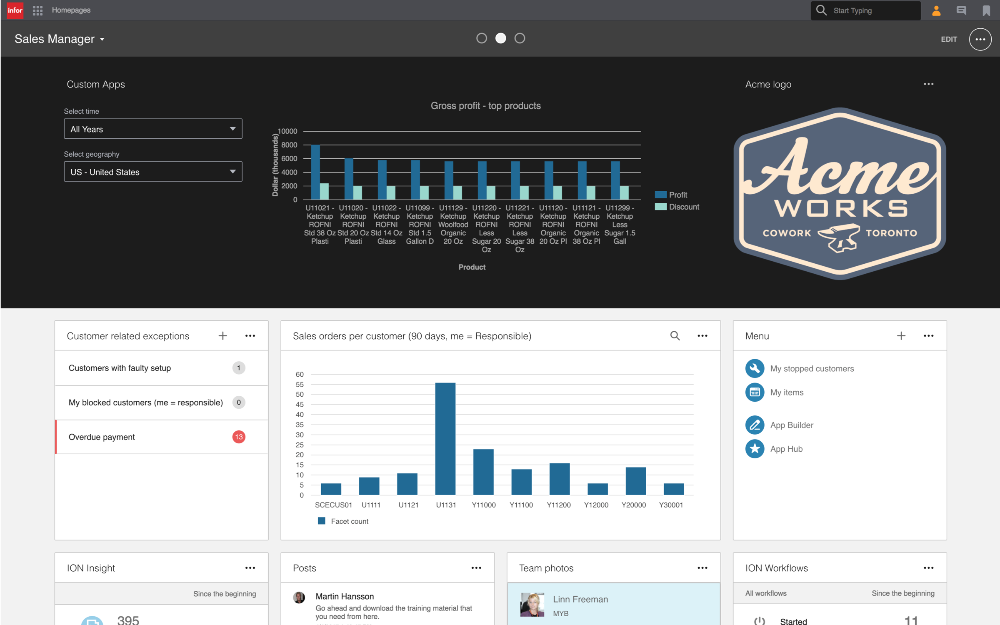

# Getting Started
{: .no_toc }

This page gives a brief overview to getting started with the Widget SDK. For detailed instructions, please refer to the [Developer's Guide](https://github.com/infor-cloud/homepages-widget-sdk/blob/master/DevelopersGuide.pdf).


## Table of contents
{: .no_toc .text-delta }

1. TOC
{:toc}

## The Who and the What

The Widget SDK is used to build widgets for [Infor Homepages](https://www.youtube.com/watch?v=PP7f6T442JY). The SDK is aimed at web developers who have knowledge about:
* [JavaScript](https://www.javascript.com/)
* [HTML](https://www.w3schools.com/html/)
* [CSS](https://www.w3schools.com/css/default.asp)
* [TypeScript](https://www.typescriptlang.org/)
* [Angular](https://angular.io/)

## What is a widget?
A widget can be defined as a small, single-purpose application that provides quick, at-a-glance information or quick access to simple interactive functions. Widgets are simpler and faster to access than full applications (apps) that may provide more functionality.



Homepages may contain one or many pages and each page may contain one or many widgets. Widgets can be added to a page from the Widget Catalog.

### Tenant Widgets
{: .no_toc }

A tenant widget is a widget developed by a partner or customer of Infor. Tenant widgets can be uploaded and installed in an cloud environment via the Homepages Administration Tool. 

For instructions on how to install a Tenant Widget, please see [Support & FAQ](support-faq).

## Download the Widget SDK

The latest Widget SDK deliverable can be found on the [Widget SDK GitHub page](https://github.com/infor-cloud/widget-sdk).

### What's Included
{: .no_toc }

The Widget SDK zip file includes documentation (Developer's Guide and a Framework API reference), source code, Widget samples project and a simple NodeJS server to run the samples on if not using the included Visual Studio solution.

### Dependencies
{: .no_toc }

To use all parts of the Widget SDK you will need [Node.js](https://nodejs.org/en/), a [TypeScript compiler](http://www.typescriptlang.org/) and an [Integrated development environment or a Text Editor](https://code.visualstudio.com/). 

## Install Node.js dependencies

If you want to use any of the following parts of the SDK you need to install the Node.js dependencies. If you don't plan to use any of these you can just skip this step.

* Angular - Angular source code and typings matching the version used for Homepages.
* Web server - A simple development web server.
* ION API Proxy - A developmemt proxy for widgets that use the Infor ION API.
* Homepages script - Minify and pack widget into a production zip.

#### Install with npm
{: .no_toc }

Run the following command in the Samples directory to install the Node.js dependencies.
```
npm install
```
#### Install with Windows command file
{: .no_toc }

Run the `Install.cmd` command file in the Samples directory to install the Node.js dependencies.
```
Install.cmd
```
## Widget sample code

To get an overview of the widget sample code you can open it in your development environment.

### Visual Studio Code
{: .no_toc }

Start Visual Studio Code and use `File > Open Folder` and navigate to Samples/Widgets.

## Configure Web server

The SDK includes a Node.js development web server that be used for viewing sample widgets and developing widgets. The web server is optional if you have another alternative such as the web server in Visual Studio. The web server will run on `http://localhost:8080` by default and serve files from the `./Widgets` directory.

### Start web server in Visual Studio Code
{: .no_toc }

Start the web server in Visual Studio Code by running the build task `Start Server` (CTRL+SHIFT+B).

### Start web server with Windows command file
{: .no_toc }

Use the `StartServer.cmd` command file to start the web server. Edit the command file to change the default port and path.
```
StartServer.cmd
```

### Start web server with npm
{: .no_toc }

Use one of the following npm commands to start the web server. The port and path can be changed in the configuration section of the package.json file, see server_port and server_path.
```
npm start
```
```
npm run server
```

### Start web server with node
{: .no_toc }

Use one of the following node commands to start the web server. The port and path can be provided as parameters. If no parameters are specified the default port 8080 and the default path `./Widgets` will be used
```
node server
```
```
node server 8080 "./Widgets"
```

## View samples

Once the web server is running you can view the default sample by navigating a browser to `http://localhost:8080/index.html`.

### View samples with Windows command file
{: .no_toc }

Use the `OpenSamples.cmd` command file to open the default sample in the default browser on Windows.
```
OpenSamples.cmd
```

## Compile samples

Compile all the TypeScript samples in Visual Studio Code by running the build task `Typescript Watch` (CTRL+SHIFT+B). The files are watched, and will be recompiled automatically when saved. Refresh your browser to see the changes.

## ION API Proxy

When developing widget that use ION API you can use the included proxy. See the ION API samples in the Samples/Widgets directory for more information. You need to know the hostname and port of the ION API server to be able to configure the proxy.

### Start proxy with Windows command file
{: .no_toc }

Start the proxy using the `StartIonApiProxy.cmd` command file. Make sure to edit the command and provide correct values for the local port, remote  host and port.
```
StartIonApiProxy.cmd
```

### Start proxy with npm
{: .no_toc }

Use the following npm command to start the proxy. The local port, remote host and remote port can be changed in the configuration section of the package.json file, see proxy_local_port, proxy_remote_host and proxy_remote_port.
```
npm run proxy
```

### Start proxy  with node
{: .no_toc }

Use the following node command to start the proxy. The local port, remote host and remote port and  should be provided as parameters.
```
node proxy 8083 "domain.server.com" 443
```

## Homepages command script

The homepages command script performs different commands. For the help documentation use:
```
node homepages help
```
### Package
{: .no_toc }

Widgets have to be bundled (if consisting of multiple .ts files) and minified before delivery. The package command can be used to build, minify and package a widget or a list of widgets.
```
node homepages pack "infor.sample.helloworld"
```

## Further reading

* [Developer's Guide](https://github.com/infor-cloud/homepages-widget-sdk/blob/master/DevelopersGuide.pdf)
* [Best Practices](best-practices)
* [Resources](resources)
* [Support & FAQ](support-faq)

